# 🐍 Python Hello World — Jenkins CI/CD Pipeline with Docker


A fully automated **Jenkins Declarative Pipeline** that builds, tests, and deploys a **Python Hello World** application as a **Docker image** and pushes it to **Docker Hub** 🚀.

---

## 🧭 Pipeline Overview

The Jenkins pipeline performs the following stages:

1. 🧬 **Clone Repo** — Fetch the source code from GitHub  
2. 🏗️ **Build Docker Image** — Build a Docker image using the repository’s `Dockerfile`  
3. 🧪 **Run Container** — Run the container to verify it executes successfully  
4. 📦 **Push to Docker Hub** — Tag and upload the image to Docker Hub  

---

## 🧱 Pipeline Flow Diagram

```mermaid
graph TD
    A[🧬 Clone Repo] --> B[🏗️ Build Docker Image]
    B --> C[🧪 Run Container]
    C --> D[📦 Push to Docker Hub]
    D --> E[✅ Deployment Complete]
```



---

## 🧩 Jenkinsfile

```groovy
pipeline {
    agent any

    environment {
        DOCKER_IMAGE = 'python-hello-world'
        DOCKER_TAG = 'latest'
        DOCKER_HUB_REPO = 'dhiraj23/python-hello-world'
    }

    stages {
        stage('Clone Repo') {
            steps {
                git branch: 'main', url: 'https://github.com/dhirajnimkande23/pythonhelloworld.git'
            }
        }

        stage('Build Docker Image') {
            steps {
                script {
                    dockerImage = docker.build('python-hello-world')
                    echo 'Docker Image build successful'
                }
            }
        }

        stage('Run Container') {
            steps {
                script {
                    dockerImage.run()
                    echo 'Container created successfully'
                }
            }
        }

        stage('Push to Docker Hub') {
            steps {
                script {
                    docker.withRegistry('https://index.docker.io/v1/', 'dockerhub-creds') {
                        sh 'docker tag python-hello-world dhiraj23/python-hello-world:latest'
                        sh 'docker push dhiraj23/python-hello-world:latest'
                        echo 'Docker image pushed to Docker Hub successfully'
                    }
                }
            }
        }
    }
}
```

---

## ⚙️ Prerequisites

Before you run this pipeline, make sure you have:

✅ Jenkins installed and configured  
✅ Docker and Git installed on the Jenkins agent  
✅ A Jenkins credential named **`dockerhub-creds`** with your Docker Hub username/password  
✅ Network access to Docker Hub  

---

## 🌐 Docker Hub Repository

After successful execution, your image will be available here:  
👉 **[dhiraj23/python-hello-world](https://hub.docker.com/r/dhiraj23/python-hello-world)**

You can pull it using:

```bash
docker pull dhiraj23/python-hello-world:latest
```

---

## 🧠 Additional Notes

- Modify the `DOCKER_TAG` environment variable to push with custom tags (e.g., `v1.0`, `dev`, etc.).  
- You can add more stages (like code testing, linting, or security scanning) before pushing to production.  
- Works seamlessly with **Docker Hub**, but can easily be adapted for **AWS ECR**, **GCR**, or **Azure ACR**.

---

## 🖋️ Author

👤 **Dhiraj Nimkande**  
📦 Docker Hub: [dhiraj23](https://hub.docker.com/u/dhiraj23)  
💻 GitHub: [@dhirajnimkande23](https://github.com/dhirajnimkande23)
